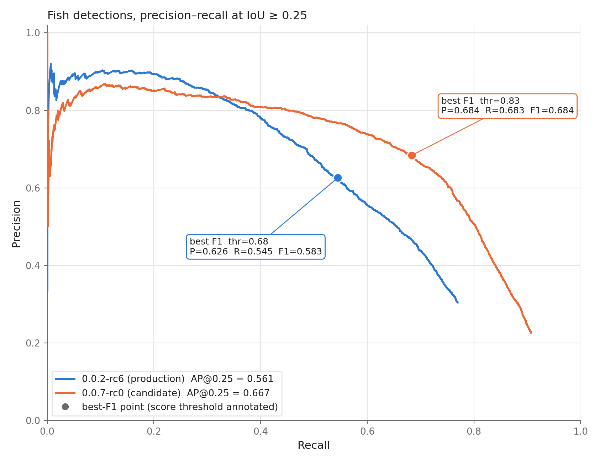
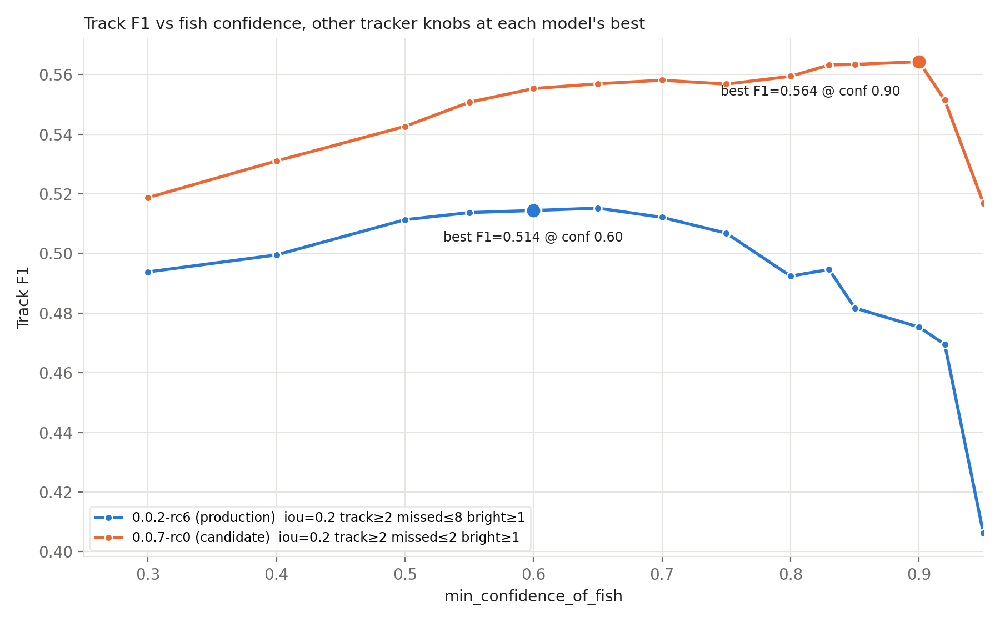

# omni-detector 0.0.7-rc0 vs 0.0.2-rc6 on Viam-generated-like images

Evaluation report, 2026-09-08; revised 2026-09-09: frame-level GT counts `single_blob`, fragment
guide added (§6), test set moved to Appendix A, recommendation folded into §1, models named 0.0.2 /
0.0.7 in the text (the figures still say rc6 / rc0). Brief: `SPEC-omni-0_0_7-eval-report.md`.
Assets: `REPORT-omni-detector-0_0_7-rc0-assets/`.

Vocabulary: images rendered from raw sonar data are **Viam-generated images**. The test set here is
**Viam-generated-like**: screenshot crops with background and UI overlays stripped, left|right panels
stitched side by side.

## 1. Summary

`omni-detector-0_0_7-rc0` is trained on Viam-generated-like stitched images, the production model
`omni-detector-0_0_2-rc6` on raw screenshots (§2). Both ran on the same rebuilt test set of 2942
stitched frames — 3340 fish boxes, 700 frames without fish (Appendix A) — each reported at its own
best-F1 point.

**Draft call: go** — promote 0.0.7-rc0 for the Viam-generated-image path, with `min_confidence_of_fish`
set explicitly on `generated-sonar-fp` (unset in v108, so 0.5 applies); §6 lists the fragment changes
item by item. The numbers that drive it:

| Metric (same test set, same settings) | 0.0.2 | 0.0.7 | Δ |
|---|---|---|---|
| Best frame F1 (score threshold) | 0.583 (0.68) | 0.684 (0.83) | +0.101 (+17.3%) |
| Frame precision / recall at best F1 | 0.626 / 0.545 | 0.684 / 0.683 | +0.058 (+9.3%) / +0.138 (+25.3%) |

Against production today (0.0.2 on raw screenshots, a different test set, §4); percentages are relative
to that row:

| Tracker | Precision | Recall | F1 |
|---|---|---|---|
| Production today: 0.0.2 on screenshots | 0.740 | 0.376 | 0.499 |
| After the switch, old model: 0.0.2 on Viam-generated-like images | 0.618 (−16.5%) | 0.441 (+17.3%) | 0.514 (+3.0%) |
| After the switch, new model: 0.0.7 on Viam-generated-like images | 0.738 (−0.3%) | 0.457 (+21.5%) | 0.564 (+13.0%) |

At its best-F1 point 0.0.7 finds substantially more fish than 0.0.2 does at its own, and at higher
precision. Its PR curve dominates 0.0.2 wherever recall exceeds 0.32, and with tracker knobs tuned per
model it leads at every confidence from 0.30 to 0.95, by 0.05 F1 at the optima.

## 2. Context

Production today runs the detector on screenshots of the vendor sonar display (`screen1`) through
`vision-omni-detector` (ONNX, `background_strip_dist: 150`) and the `vision-predict-fish` BlobTracker.
The next input path is Viam-generated images: sonar views rendered from raw sonar data by our own
renderer, consumed by the `generated-sonar-cam` → `generated-sonar-fp` pipeline that fragment v108
defines but leaves disabled (`detector_input_mode: stitched`: H fan left | h3 overlay right, plain
horizontal concatenation, no divider).

We do not yet have an annotated set of Viam-generated images. The closest proxy is Viam-generated-like
preprocessing of annotated screenshots: crop the two sonar views, strip background and overlays, heal
marker holes inside GT boxes, pad square, stitch left|right into one image. That is the domain 0.0.7 was
trained on and it matches what `generated-sonar-fp` feeds the detector.

The comparison that matters is therefore 0.0.2 versus 0.0.7 on Viam-generated-like images: what production
would do after the input switch with the old model against the new one. 0.0.2's tracker numbers on raw
screenshots, today's production input, appear in §1 and §4 as the baseline.

| Model | Status | Classes | Input | Training domain |
|---|---|---|---|---|
| `omni-detector-0_0_2-rc6` | production (v108 `packages.omni-detector`) | fish, triangle | model-native | raw screenshots |
| `omni-detector-0_0_7-rc0` | candidate | fish only | 600×1200 (Faster R-CNN) | Viam-generated-like stitched (`omnitrainres/stitched`) |

The test set, its lineage, its label drift and what the preprocessing discarded: Appendix A.

## 3. Frame-level results

`torch-training-script/evaluate_onnx.py` caches every prediction with no confidence filter. The
fish-class precision–recall curve at IoU ≥ 0.25 is computed from that cache with `compute_det_curves`,
and each model is reported at its own best-F1 point on the curve. 0.0.2's triangle outputs are ignored (the
set has no triangle GT). Both models saw all 2942 images including the 700 negatives. The GT is the
frame-eval jsonl of Appendix A: `ground_truth_coco_frame_eval.json` in each eval dir has 2942 images and 3340
annotations, and was rebuilt against the cached, GT-independent predictions with the image ids asserted
identical to the original run. Source: `REPORT-omni-detector-0_0_7-rc0-assets/frame_metrics.json`
(fish-only variant: `frame_metrics_fish_only_gt.json`).

| Model | Best-F1 score threshold | Precision | Recall | F1 | TP | FP | FN |
|---|---|---|---|---|---|---|---|
| 0.0.2 (production) | 0.68 | 0.626 | 0.545 | 0.583 | 1820 | 1086 | 1520 |
| 0.0.7 (candidate) | 0.83 | 0.684 | 0.683 | **0.684** | 2282 | 1055 | 1058 |

| Model | AP @ IoU 0.25 (fish curve) | COCO AP (0.50:0.95) | COCO AP50 | COCO AP75 | fish predictions (unfiltered) |
|---|---|---|---|---|---|
| 0.0.2 | 0.561 | 0.214 | 0.493 | 0.134 | 8442 |
| 0.0.7 | **0.667** | **0.267** | **0.593** | **0.204** | 13380 |

The same predictions against the fish-only GT (3149 boxes, 767 negatives), for reference:

| GT variant | 0.0.2 F1 (P / R) | 0.0.7 F1 (P / R) | AP@0.25 0.0.2 / 0.0.7 |
|---|---|---|---|
| fish + `single_blob` (above) | 0.583 (0.626 / 0.545) | 0.684 (0.684 / 0.683) | 0.561 / 0.667 |
| fish only | 0.582 (0.606 / 0.559) | 0.679 (0.660 / 0.699) | 0.560 / 0.658 |

The best-F1 thresholds are the same under both GTs. Counting `single_blob` turns 59 of 0.0.2's and 81 of
0.0.7's false positives into true positives at those thresholds: both models already fire on one-frame
echoes, 0.0.7 more often.



*Figure 1. Fish-class precision–recall at IoU ≥ 0.25 on the 2942-frame stitched test set, GT fish +
`single_blob`. Filled markers: each model's best-F1 point with its score threshold. Legend: AP of each curve.*

0.0.7's curve dominates 0.0.2's for recall above about 0.32; below that, 0.0.2 is a few points more precise. At
their best-F1 points 0.0.7 has both higher precision and 0.14 more recall, at a higher score threshold (0.83
vs 0.68): its scores separate fish from clutter better, so it can be cut harder. Points:
`REPORT-omni-detector-0_0_7-rc0-assets/pr_points.json`.

## 4. Tracker results

Offline BlobTracker run: fish-predictor `test-images` (branch `test-images-config-key-alias`, `e611548`)
on the 218 converted sequences, detections from `kongsberg-annotate-sequences` at confidence 0.1
(annotated once per model and reused for every configuration), `kongsberg-evaluate` with the default
GT-eval params (match IoU 0.2, link IoU 0.2, temporal window 2, dedupe 0.9) fixed throughout. Fixed
tracker settings: `disable_triangle_suppression: true`, `enable_exclusion_zone: false` (the CLI cannot
run the boat detector offline; production has it on). Source:
`REPORT-omni-detector-0_0_7-rc0-assets/tracker_sweep_metrics.json` (+ `tracker_sweep_results.csv`);
the first, un-swept runs are in `tracker_metrics.json`.

**Parameter sweep.** The same grid was run for both models: `min_confidence_of_fish`
{0.5, 0.6, 0.7, 0.8, 0.83, 0.9} × `iou_threshold` {0.07, 0.2} × `min_track_length` {2, 3} ×
`max_missed_frames` {2, 4, 8} × `min_bright_center` {1}, 72 configurations per model, plus a fine
confidence sweep (14 values from 0.30 to 0.95) at each model's best structural knobs. 227 runs at about
12 s each. The tracker knobs of fragment v108 were included as a grid point and reproduced the first,
un-swept run exactly (sanity check). Pruned with evidence during the run: `min_track_length` 1 is identical to 2 (a promoted
track needs two frames anyway); `min_bright_center` 2 is worse than 1 in all 54 paired 0.0.7 configurations
(F1 −0.025 to −0.048); `max_missed_frames` moves F1 by at most 0.011; `iou_threshold` 0.2 beats 0.07 in
most configurations (mean +0.006 F1).

| Model | Knobs (conf / IoU / min track / max missed / bright) | GT tracks | Pred tracks | TP | FP | FN | Precision | Recall | F1 |
|---|---|---|---|---|---|---|---|---|---|
| 0.0.2, **best F1** | 0.60 / 0.2 / 2 / 8 / 1 | 547 | 395 | 241 | 149 | 306 | 0.618 | 0.441 | **0.514** |
| 0.0.7, **best F1** | 0.90 / 0.2 / 2 / 2 / 1 | 547 | 354 | 250 | 89 | 297 | 0.738 | 0.457 | **0.564** |

The best shared configuration (maximum mean F1 over the common grid) is 0.0.2's best; 0.0.7 scores
0.554 there. 0.0.2 at 0.0.7's best configuration drops to F1 0.482 (precision 0.827, recall 0.340).
The two models want different operating points: 0.0.2 peaks at confidence 0.60–0.65 and degrades
above 0.7, 0.0.7 keeps improving up to 0.90 and collapses only past 0.92 (0.92 → 0.551, 0.95 →
0.517). 0.0.7's optimum is precision-leaning: 89 false-positive tracks against 0.0.2's 149 at its
own optimum, at the cost of 15 duplicate tracks (fragmentation from `max_missed_frames` 2) against
5.



*Figure 2. Track F1 against `min_confidence_of_fish` from the sweep, the other tracker knobs held at each
model's best structural setting (0.0.7: IoU 0.2, track 2, missed 2; 0.0.2: IoU 0.2, track 2, missed 8).*

With each model's own best structural knobs, 0.0.7 leads 0.0.2 at every confidence from 0.30 to 0.95.

### Production baseline: 0.0.2 on screenshots

Production today runs 0.0.2 on raw screenshots through `vision-predict-fish`. Its most recent tracker
evaluation was run on **screenshot sequences**, a different test set from the stitched one above. Source:
stand-up notes of 2026-08-24.

| Setup | Test set | Precision | Recall | F1 |
|---|---|---|---|---|
| **Production today**: 0.0.2 on screenshots | screenshot sequences (different set) | 0.740 | 0.376 | 0.499 |
| 0.0.2 on Viam-generated-like images, best swept knobs | 218 stitched sequences (this report) | 0.618 | 0.441 | 0.514 |
| 0.0.7 on Viam-generated-like images, best swept knobs | 218 stitched sequences (this report) | 0.738 | 0.457 | 0.564 |

The two lower rows are the report's comparison: same test set, same tracker, same detections pipeline.
The baseline row is a reference for where production stands, not a third arm of that comparison, since
sequence sets differ. Read with that caveat: 0.0.7 on Viam-generated-like images matches production's
precision (0.738 vs 0.740) with 0.08 more recall, while 0.0.2 on the same images would trade 0.12 of
precision for 0.06 of recall.

218 sequences evaluated (rows grouped by their first `sequence_` tag, the download-script default; 232
tags occur in any position). 184 sequences have evaluable GT tracks, 34 have none
(`ground_truth_track_count == 0` in `evaluation.json`, not the same as the 26 box-negative sequences: 8
positive sequences lose all GT tracks to the evaluator's tail rule, 6 being 1-frame sequences and 2 having
a single tail-only box).

Frames are numbered contiguously over surviving frames; `frame_manifest.json` per sequence records the
gaps. Inter-frame gaps (`sequences_omnitestres_v2_stitched/conversion_report.json`): median 1 s, mean
1.68 s, p90 2 s, max 56 s; 102 gaps over 5 s, 2 over 30 s. Sequence lengths 1 / 2–4 / ≥5 frames:
9 / 38 / 171.

Run dirs: `sequences_omnitestres_v2_stitched/runs/run-20260908-204818` (0.0.7, un-swept first run, 1199 s incl.
annotation), `runs/run-20260908-210323` (0.0.2, un-swept first run, 860 s), and `runs/sweep-<tag>-<cfg_id>/` for
every sweep configuration (each with `evaluation.json`, `config.json`, per-sequence output).

## 5. Caveats

- **The tracker eval is a proxy.** It uses the screenshot-path BlobTracker with the `vision-predict-fish`
  knobs and the exclusion zone off (the CLI cannot run the boat detector offline; production has it on).
  The pipeline 0.0.7 would serve, `generated-sonar-fp`, runs a world-space merged tracker over four fan
  frames plus GPS exclusion, which screenshot-derived data cannot replay. Track numbers compare the two
  detectors under one tracker; they are not a forecast of `generated-sonar-fp` behaviour.
- **Confidence on the target pipeline.** `generated-sonar-fp` in v108 leaves `min_confidence_of_fish`
  unset, so the module default 0.5 applies. Both models' best-F1 thresholds are higher (0.0.7: 0.83 at the
  frame level, 0.90 for tracks; 0.0.2: 0.68 and 0.60–0.65). At 0.5 0.0.7's track F1 is 0.543 with its best
  structural knobs, against 0.564 at 0.9.
- **JPEG re-encode.** `test-images` decodes only JPEG, so stitched PNGs were re-encoded at quality 95.
  Detections were produced on the same JPEGs; in offline mode pixels feed only the hot-center check.
- **Incomplete sequences.** Frames dropped by the crop stage leave head, tail, and internal gaps (12
  sequences with an internal gap, 102 inter-frame gaps over 5 s). The tracker sees jumps it would not see
  live, for both models alike.
- **Nothing about the screenshot path.** 0.0.7 was not trained on raw screenshots and was not evaluated
  on them. The screenshot path keeps 0.0.2 (§6, items 1 and 7).
- **Single-view displays absent.** 668 source frames from single-view layouts fail the crop stage and
  cannot be stitched. Nothing here says how either model does on them.
- **`single_blob` handling.** The 2026-09-08 re-export moved 219 boxes to `single_blob`. They count as
  fish GT at the frame level (191 survive stitching) and not at the track level (Appendix A). Treating them as
  ignore regions instead, counted neither as hits nor as misses, is an open discussion point
  (`RESEARCH-detector-tracker-comparison-standards.md`). GT counts differ from the export the model was
  trained against.
- **The screenshot baseline is a different test set.** The production numbers in §4 (0.0.2 on screenshots,
  P 0.740 / R 0.376 / F1 0.499, stand-up notes of 2026-08-24) come from a separate run on screenshot
  sequences. Differences against the stitched-set rows are indicative of the input switch, not measured
  on one set.
- **In-sample tracker tuning.** The best-F1 tracker knobs were selected on this test set, so the
  best-F1 rows are optimistic for both models, as are the frame-level best-F1 thresholds. The sweep used
  one shared grid and the same detections for both models, so the comparison between them is fair. The
  GT-eval parameters were not swept.
- **CLI confidence key.** Every earlier offline `test-images` run silently used the 0.8 default fish
  confidence because the CLI read `min_confidence_of_fish_detector` while configs wrote
  `min_confidence_of_fish`. These runs use the aliased key and log the effective value; older offline
  track numbers are not comparable.

## 6. Fragment changes for the promotion

Principle: 0.0.7 serves the Viam-generated-image path only; the screenshot path stays on 0.0.2. Every item
below was checked against `resources/sonar-ai-v3-fragment-v108.json`, fish-predictor `origin/main`
(`01e935c`, tag `4.0.2-rc1`, the shipping module) and sonarmarker `origin/main` (`d389cdd`). Line
numbers refer to the v108 file.

| # | Where (v108) | Change | Why |
|---|---|---|---|
| 1 | `packages` (l. 509–528) | Add a second entry: `name` `omni-detector-0-0-7`, same `package` id `4a0a99c7-…/omni-detector`, `type` `ml_model`, `version` `0.0.7-rc0`. Keep `omni-detector` at `0.0.2-rc6`. | Both onnx services point at the one `omni-detector` entry today (l. 421/423 and 471/473), and the screenshot path must stay on 0.0.2. The RDK requires package `name`s to be unique, not package ids, and extracts each version into its own directory (`config.go` `SanitizedName`), so one package id at two versions coexists. No precedent in our fragments; first time we rely on it. |
| 2 | `generated-sonar-vs`, `viam:vision:onnx-detector` (l. 465–477) | `model_path` and `labels_path` → `${packages.ml_model.omni-detector-0-0-7}/…`; `disabled` → `false`. Leave `min_confidence: 0.5` (a floor; the fish-predictor threshold governs) and leave `background_strip_dist` absent. | Viam-generated images carry no screenshot background to strip, and the evaluation ran without the strip. The screenshot-path service sets `background_strip_dist: 150`; that difference is intended. |
| 3 | `generated-sonar-fp`, `kongsberg:fish-predictor:synthetic-image-fish-detect` (l. 445–462) | `disabled` → `false`; add `"min_confidence_of_fish": 0.9`; consider `"max_missed_frames": 2` (4 today). Keep `min_track_length: 2`, `min_bright_center: 1`. | Unset today, so the module default 0.5 applies. 0.0.7's best track F1 in the sweep sits at 0.90 for both swept IoU values, and with the v108 structure (track 2, missed 4) F1 rises monotonically from 0.5 to 0.9. `max_missed_frames` moves F1 by at most 0.011. All in-sample: starting points, not tuned values. |
| 4 | `generated-sonar-fp` | Do not look for `iou_threshold`; this model has `ground_iou_threshold` instead (world-space IoU, default 0.1, unset in v108). Leave it. | The sweep's `iou_threshold 0.2` is a BlobTracker pixel-IoU knob and does not transfer. `ground_iou_threshold` was not evaluated. The same module also lacks `disable_triangle_suppression`, `enable_exclusion_zone`, `boat_detector_name` and the `small_boat_*` keys; its exclusion zone is GPS-based (`exclusion_zone_*`, already set). |
| 5 | `generated-sonar-cam` (l. 4–28) and the four `horizontal-*-sensor` components (l. 55, 83, 111, 139) | `disabled` → `false` on the camera and the sensors. The sensors' `data_manager` `Readings` capture (l. 48, 76, 104, 132) is a separate decision: raw-sonar upload volume. | The camera reads the four fans from those sensors. |
| 6 | `generated-filtered-cam-potential` / `-predicted` (l. 197–241) | Decide: enable and add a `service_configs` data-manager block mirroring `camera-save-*` (`GetImages` at 1 Hz, ±10 s window, `cooldown_s`), or leave disabled. Their filters (`potential_fish` / `predicted_fish` at 0.6 on `generated-sonar-fp`) already match the labels the path emits. | They exist but carry no capture block, so enabling the path alone yields no label-keyed capture from it. `raw_sonar_pair_cap_control` (l. 145–195) triggers off `vision-predict-fish`, not the generated service; unchanged here. |
| 7 | Screenshot path: `vision-omni-detector`, `vision-predict-fish`, `camera-save-*` | No change. | 0.0.7 has no `triangle` class. With `disable_triangle_suppression: true` the screenshot path re-emits `triangle` boxes (`processor.go:488–498`) that sonarmarker's placemarker suppresses against; 0.0.7 there would silently empty them. |
| 8 | sonarmarker (not part of this fragment) | Nothing for the screenshot placemarker. For the generated path, sonarmarker `origin/main` ships `viam-soleng:ai-sonar-marker:placemarker-synthetic`, which reads `predicted_fish` and `bait_ball` and needs no `triangle`. | Compatible with 0.0.7's single class. Its `bait_ball_metadata` read is never populated by the synthetic fish-predictor and degrades to a no-op. |

Label compatibility: `synthetic-image-fish-detect` keeps only detector classes whose name contains
`fish` (`pipeline.go:261`) and emits `potential_fish` / `predicted_fish`; 0.0.7's one class passes
unchanged. Minimal JSON for items 1–3:

```json
"packages": [
  { "name": "omni-detector",       "package": "4a0a99c7-e680-4cb5-acb1-0bd21449b455/omni-detector", "type": "ml_model", "version": "0.0.2-rc6" },
  { "name": "omni-detector-0-0-7", "package": "4a0a99c7-e680-4cb5-acb1-0bd21449b455/omni-detector", "type": "ml_model", "version": "0.0.7-rc0" }
]
// generated-sonar-vs
"model_path":  "${packages.ml_model.omni-detector-0-0-7}/model.onnx",
"labels_path": "${packages.ml_model.omni-detector-0-0-7}/labels.txt",
"disabled": false
// generated-sonar-fp
"min_confidence_of_fish": 0.9,
"max_missed_frames": 2,
"disabled": false
```

Not covered by this report: how the merged world-space tracker behaves with `ground_iou_threshold`
0.1 (the evaluation used the BlobTracker, §5), and the raw-sonar capture volume once the sensors run.

## Appendix A. Test set

### Lineage

```
omnitest_6_15/                        Viam dataset export (re-exported 2026-09-08 17:22), 3852 screenshots
  └─ create_single_view_dataset.sh    kongsberg-training-utils, restore branch @15bee6f, --heal
       └─ omnitestres_v2/             6043 crop rows (left/right), 751 frames to unused/
            └─ stitch_single_views.py   new stitcher (validated against the old one)
                 └─ omnitestres_v2/stitched/   2942 frames, pairs.json (+has_fish), 159 singles not stitched
```

Rebuild parameters (`omnitestres_v2/debug.log`, first line):

```
PARAMS {"dataset": ".../omnitest_6_15", "gt_labels": "human_annotated_positive_fish_blob", "dist": 150, "min_area": 0, "heal": true, "debug": false, "created": "2026-09-08T23:56:42Z"}
```

The previous stitched set (`omnitestres/stitched/`, 2268 frames) was built by a stitch script that is
not recoverable and that dropped every frame without fish GT. The new stitcher reproduces it exactly on
the old crops (2268/2268 pixel-identical images, 3276 boxes within 1e-16) and keeps zero-box pairs.

### Label drift

`omnitest_6_15` was re-exported on 2026-09-08. Since the original build, 219 boxes in the source carry
the `single_blob` label: an echo seen in exactly one frame of its sequence. The stitched set has 3149
`human_annotated_positive_fish_blob` boxes where the old set had 3276.

`single_blob` is treated differently at the two levels. The tracker cannot produce a track for a one-frame
echo (`min_track_length` 2), so the tracker GT is `human_annotated_positive_fish_blob` only. A detector
should still find it, so the frame-level GT counts it as fish: 191 `single_blob` boxes on 156 of the 2942
frames (67 of them otherwise negative) are carried in from a second pipeline run and relabeled to the fish
class in `datasets/omnitestres_v2/stitched/dataset_frame_eval.jsonl`, over the same images
(`dataset_frame_eval_report.json`; method in Appendix B).

| GT | Fish boxes | Negative frames | Used by |
|---|---|---|---|
| fish + `single_blob` (`dataset_frame_eval.jsonl`) | 3340 | 700 | frame-level eval, §3 |
| fish only (`dataset.jsonl`) | 3149 | 767 | tracker eval, §4; discard accounting below |

### What the preprocessing discarded (source → stitched)

| Quantity | Old set (`omnitestres/stitched`) | Rebuilt (`omnitestres_v2/stitched`) |
|---|---|---|
| Source frames | 3852 | 3852 |
| Kept (stitched) | 2268 | 2942 |
| Discarded | 1584 (41%) | 910 (23.6%) |
| Fish-negative frames discarded | 1099 of 1168 (94%) | 401 of 1168 (34.3%) |
| Fish-positive frames discarded | 485 of 2684 (18%) | 509 of 2684 (19.0%) |
| Negative frames in the set | **0** | **767** of 2942 |
| Fish GT boxes | 3276 | 3149 |
| Sequences source → stitched | 301 → 209 | 301 → 232 |
| Positive sequences fully lost / partial / complete | 54 / 78 / 128 of 259 | 54 / 16 / 189 of 259 |
| Negative sequences fully lost / partial / complete | 39 / – / – of 42 | 15 / 2 / 25 of 42 |
| Sequences with zero fish GT | **0** | **27** |
| Dropped frames at sequence head / tail / internal | 158 / 156 / 171 | 9 / 9 / 29 |
| Sequences with an internal gap | 51 | 12 (run lengths 11×1, 6×2, 1×6) |
| Sequences with 1 frame / 2–4 / ≥5 | 6 / 29 / 174 | 9 / 25 / 198 |
| Single-crop frames not stitched | n/a | 159 |

Both columns computed by `scripts/report_dataset_completeness.py` against today's export (old column
with `--raw-sequence-tags`; its sequence buckets differ slightly from the grill-me numbers because 11
sequence tags were added since). Full table: `omnitestres_v2/stitched/rebuild_report.md`.

### Two discard causes

1. **Crop-stage failure on single-view displays.** 668 frames fail with
   `WARN CROP … single layout … center circle check failed` (plus 93 double-layout failures). Single-view
   screenshots cannot be paired into a stitched image. This is a coverage gap of the stitched domain,
   not something the eval can fix.
2. **The old stitch step dropped frames without fish GT.** Fixed. The new stitcher keeps zero-box pairs,
   so 767 negative frames and 27 negative sequences are in the set.

Minor drops: 36 frames where one view had no echo left after stripping, 4 GT boxes matched no crop, 9
frames with an obscured half (only the sibling crop survives, so they end up as singles).

### Image sizes

Stitched images come in 7 sizes (1976×988: 2372; 1316×658: 275; 1400×700: 113; 1984×992: 110;
1960×980: 36; 1422×711: 21; 1324×662: 15), reflecting different display resolutions. The old set had 6
sizes too. Frame eval resizes to the model input; the tracker eval maps normalized coordinates onto each
image's own bounds. 29 pairs had crops differing by 2 px in height and were resized to match (LANCZOS,
as the original stitcher did).

## Appendix B. Reproduction

Code. The first two branches are pushed with PRs open (kongsberg-training-utils [#169](https://github.com/viam-modules/kongsberg-training-utils/pull/169) against `restore`, fish-predictor [#92](https://github.com/viam-modules/fish-predictor/pull/92) against `main`); the third is local, stacked on the first:

| Repo | Branch | Base | Commits | Contents |
|---|---|---|---|---|
| `kongsberg-training-utils` | `eval-stitched-sequences` | `origin/restore` @ `15bee6f` | `0ec8b78`, `37f1249` | `src/sonar/stitch_views.py` + `scripts/stitch_single_views.py`; `src/sonar/dataset_completeness.py` + `scripts/report_dataset_completeness.py`; `src/sequences/dataset_sequences.py` + `scripts/build_sequences_from_dataset.py`; tests (28); docs section in `docs/single-view-dataset-pipeline.md` |
| `fish-predictor` | `test-images-config-key-alias` | `origin/main` @ `01e935c` | `e611548` | `cmd/test-images/main.go`: `min_confidence_of_fish` alias (module key wins with a warning if both differ), `effective config:` startup line; `cmd/test-images/config_test.go` |
| `kongsberg-training-utils` | `frame-eval-single-blob` (not pushed) | `eval-stitched-sequences` @ `37f1249` | `62026b2` | `src/sonar/merge_frame_eval_labels.py` + `scripts/build_frame_eval_jsonl.py` (carry extra GT labels onto the canonical images, geometry-checked); 8 tests; docs section |

The branches were built in disposable worktrees under session scratchpads; the `test-images` binary
used for the runs came from the `test-images-config-key-alias` worktree (`make test-images`).

Data and runs:

| Artifact | Path |
|---|---|
| Single-view rebuild | `datasets/omnitestres_v2/` (`debug.log`, `unused/`) |
| Stitched test set + handoff | `datasets/omnitestres_v2/stitched/` (`rebuild_report.{json,md}`, `stitch_report.json`, `pairs.json`) |
| Frame eval dirs | `torch-training-script/eval_omni-detector-{0_0_7-rc0,0_0_2-rc6}_omnitestres_v2-stitched/` (`predictions.json` cache, `ground_truth_coco.json` fish-only, `ground_truth_coco_frame_eval.json` fish + `single_blob`) |
| Frame-eval GT | `datasets/omnitestres_v2/stitched/dataset_frame_eval.jsonl` + `dataset_frame_eval_report.json` (191 `single_blob` boxes carried in; 3149 fish boxes reproduced on 2942/2942 rows) |
| Sequences for the tracker | `sequences/sequences_omnitestres_v2_stitched/` (`conversion_report.json`, `detections-ground-truth.json`, `detections-omni-*.json`) |
| Tracker runs, first (un-swept) | `sequences_omnitestres_v2_stitched/runs/run-20260908-204818` (0.0.7), `runs/run-20260908-210323` (0.0.2); each has `evaluation.json`, `config.json`, `stdout.log` |
| Tracker sweep runs | `sequences_omnitestres_v2_stitched/runs/sweep-<tag>-<cfg_id>/` (227 dirs; `sweep-omni-0.0.7-rc0-c0.90_i0.20_t2_m2_b1` and `sweep-omni-0.0.2-rc6-c0.60_i0.20_t2_m8_b1` are the best-F1 runs) |
| Offline tracker config | `resources/test-images-config-v108.json` |
| Report assets | `REPORT-omni-detector-0_0_7-rc0-assets/{frame_metrics,pr_points,tracker_metrics,tracker_sweep_metrics}.json`, `tracker_sweep_results.csv`, `pr_curve_rc6_vs_0_0_7.png`, `tracker_sweep_f1_vs_conf.png`; fish-only variants `*_fish_only_gt.*`; `scripts/` (curve, sweep, metrics builders); `_archive/` (2026-09-08 fish-only originals) |

Commands (from the repo roots; `$PKG` is a dir whose `kongsberg_utils` symlink points at the
training-utils worktree's `src/`, `$PY` its main-checkout `.venv/bin/python`):

```bash
# Dataset (kongsberg-training-utils worktree on eval-stitched-sequences); ~18 min
PYTHONPATH=$PKG PYTHON=$PY scripts/create_single_view_dataset.sh \
  --dataset ~/kongsberg/datasets/omnitest_6_15 --output ~/kongsberg/datasets/omnitestres_v2 --heal
PYTHONPATH=$PKG $PY scripts/stitch_single_views.py \
  --input ~/kongsberg/datasets/omnitestres_v2 --output ~/kongsberg/datasets/omnitestres_v2/stitched
PYTHONPATH=$PKG $PY scripts/report_dataset_completeness.py \
  --source ~/kongsberg/datasets/omnitest_6_15/dataset.jsonl \
  --derived ~/kongsberg/datasets/omnitestres_v2/stitched/dataset.jsonl \
  --debug-log ~/kongsberg/datasets/omnitestres_v2/debug.log \
  --stitch-report ~/kongsberg/datasets/omnitestres_v2/stitched/stitch_report.json \
  --output ~/kongsberg/datasets/omnitestres_v2/stitched/rebuild_report

# Frame eval (torch-training-script), per model; 14 min each on an idle machine.
# --confidence-threshold only picks the P/R row written to metrics.json; the cached predictions and the PR curve are unfiltered.
.venv/bin/python evaluate_onnx.py --model ../models/omni-detector-0_0_7-rc0/model.onnx \
  --labels ../models/omni-detector-0_0_7-rc0/labels.txt --test-data ../datasets/omnitestres_v2/stitched \
  --output-dir eval_omni-detector-0_0_7-rc0_omnitestres_v2-stitched \
  --iou-threshold 0.25 --confidence-threshold 0.7 --plot-roc
# same with omni-detector-0_0_2-rc6 → eval_omni-detector-0_0_2-rc6_omnitestres_v2-stitched

# Frame-level GT with single_blob (training-utils worktree on frame-eval-single-blob); pipeline ~18 min, rest seconds.
# The donor run supplies box geometry only; its pixels are discarded (k-means background strip is nondeterministic).
PYTHONPATH=$PKG PYTHON=$PY scripts/create_single_view_dataset.sh \
  --dataset ~/kongsberg/datasets/omnitest_6_15 --output <scratch>/omnitestres_sb \
  --gt-labels human_annotated_positive_fish_blob,single_blob --heal
PYTHONPATH=$PKG $PY scripts/stitch_single_views.py --input <scratch>/omnitestres_sb \
  --gt-labels human_annotated_positive_fish_blob,single_blob
PYTHONPATH=$PKG $PY scripts/build_frame_eval_jsonl.py \
  --base ~/kongsberg/datasets/omnitestres_v2/stitched --donor <scratch>/omnitestres_sb/stitched
# → dataset_frame_eval.jsonl; fails unless every base fish box is reproduced by the donor (2942/2942 rows, 0 mismatches)

# Curve + frame metrics from the cached predictions (torch-training-script .venv); no inference rerun
.venv/bin/python ../REPORT-omni-detector-0_0_7-rc0-assets/scripts/pr_curve.py \
  --gt-jsonl ../datasets/omnitestres_v2/stitched/dataset_frame_eval.jsonl \
  --gt-coco-name ground_truth_coco_frame_eval.json --gt-variant "fish + single_blob"
.venv/bin/python ../REPORT-omni-detector-0_0_7-rc0-assets/scripts/pr_curve.py --out-suffix _fish_only_gt

# Sequences (training-utils worktree)
PYTHONPATH=$PKG $PY scripts/build_sequences_from_dataset.py \
  --dataset ~/kongsberg/datasets/omnitestres_v2/stitched \
  --destination ~/kongsberg/sequences/sequences_omnitestres_v2_stitched

# Tracker eval (kongsberg-training-utils MAIN checkout; the script sources its own .venv); ~15–20 min each
./scripts/evaluate-sequences.sh --sequences-dir ~/kongsberg/sequences/sequences_omnitestres_v2_stitched \
  --source-tag omni-0.0.7-rc0 --model-dir ~/kongsberg/models/omni-detector-0_0_7-rc0 \
  --run-name omni-0.0.7-rc0-v108-stitched --confidence-threshold 0.1 \
  --test-images <fp-worktree>/bin/test-images \
  --test-images-config ~/kongsberg/resources/test-images-config-v108.json \
  --annotate-parallel-jobs 4 --parallel-jobs 4
# same with omni-0.0.2-rc6 / omni-detector-0_0_2-rc6
```

The tracker sweep runner (`REPORT-omni-detector-0_0_7-rc0-assets/scripts/tracker_sweep.py`,
`sweep_analyze.py`; rescued from the session scratchpad, not yet committed tooling) works like this: for each configuration it writes a config JSON (v108 base + swept knobs), runs
`evaluate-sequences.sh` **without** `--model-dir` (so the existing `detections-<tag>.json` is reused, no
re-annotation) with `--parallel-jobs 4`, and collects `evaluation.json`. `scripts/param_sweep.py` in
kongsberg-training-utils does the same with Optuna but also samples the GT-eval parameters and optimizes
precision by default; it was not used.

The PR-curve script is `REPORT-omni-detector-0_0_7-rc0-assets/scripts/pr_curve.py` (same status). It
loads `predictions.json` and a COCO GT from both eval dirs, rebuilds that GT from `--gt-jsonl` when asked
(asserting the image list matches the run's original), recomputes COCOeval, calls
`compute_det_curves(..., iou_threshold=0.25)` from `src/utils/coco_eval.py`, and marks the F1 argmax. On
the fish-only GT it reproduces the 2026-09-08 numbers exactly.
